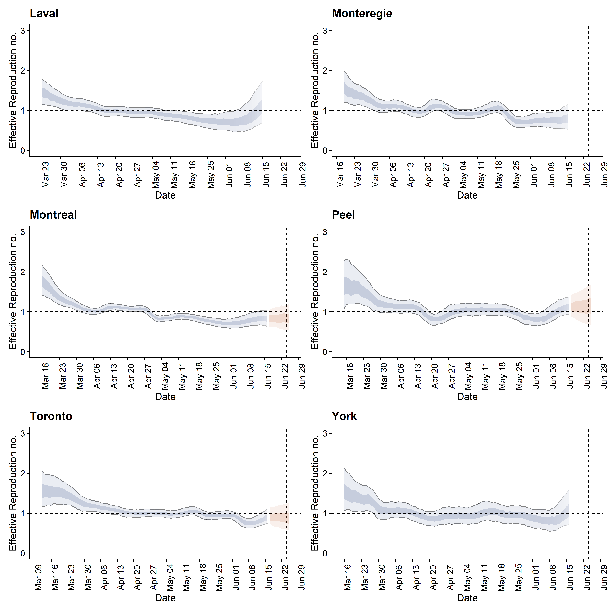
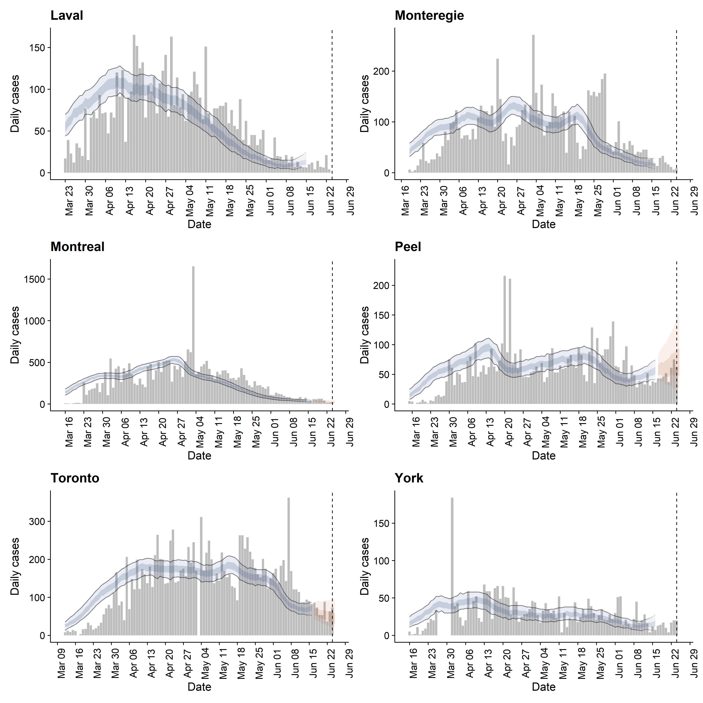
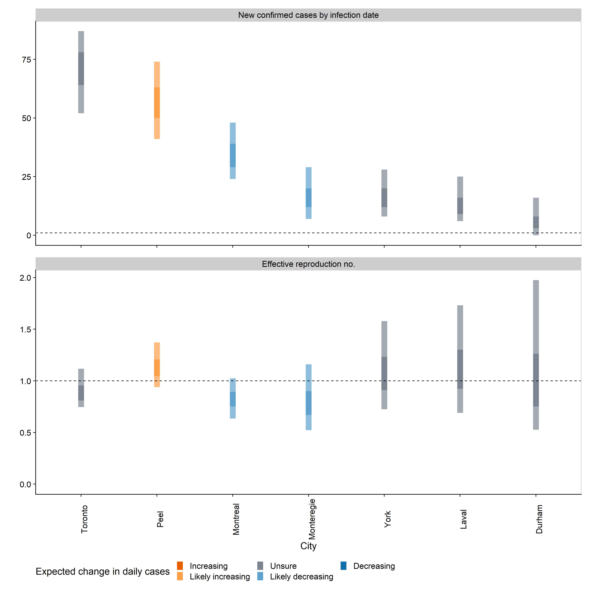

**Date Created:** Jun 01, 2020

**Date Updated:** `r format(Sys.time(), "%b %d, %Y")`

```{r setup, echo=FALSE, results='none', message = FALSE, warning = FALSE}
knitr::opts_chunk$set(message = FALSE, warning = FALSE, fig.align = "center",fig.height = 6, fig.width = 9)
options(knitr.kable.NA = '-')
```

<br>


# 1. Overall summary

* **We observed probable infection rate decrease in Monteregie and Montreal.**
* **We observed probable increase of infection in Peel.**
* **It's unclear (neither increasing nor decreasing) for other health regions.**
* **No forecast of R0 for areas with low number of daily new cases. Prediction is not completed if the last daily new case number is under 40.**

**For estimation methods please see <https://epiforecasts.io/covid/methods.html>.** 

**Complete model output generated from [the EpiNow R package](https://github.com/epiforecasts/EpiNow) is available at <https://github.com/Kuan-Liu/Kuan-Liu.github.io/tree/master/docs/city-summary>. You can find here, 1) all figures in png format, 2) estimated daily new cases with 50% and 90% credible intervals in case.csv file, 3) estimated and forecast temporal R0 with 50% and 90% Credible intervals in rt.csv file.**

<br>

# 2. Figures and tables

## (1) Estimated temporal R0 and daily new cases for Laval, Monteregie, Montreal, Toronto, Durham, Peel and York health regions

```{r echo=FALSE}
# required packages:
library(knitr)
summarytable2 <- readRDS("docs/city-summary/summary_table.rds")

kable(summarytable2[,1:4], caption = paste("Estimated temporal R0 and daily new cases for Laval, Monteregie, Montreal, Toronto, Durham, Peel and York health regions as of ", format(Sys.time(), "%b %d, %Y")), row.names = FALSE, align=c("c","c","c","c"))

```

<br>

## (2) Estimated temporal R0 for Laval, Monteregie, Montreal, Toronto, Durham, Peel and York health regions



<br>

## (3) Estimated temporal trend on daily new cases for Laval, Monteregie, Montreal, Toronto, Durham, Peel and York health regions



<br>

## (4) Estimated current/latest number of daily new cases and R0 for Laval, Monteregie, Montreal, Toronto, Durham, Peel and York health regions


