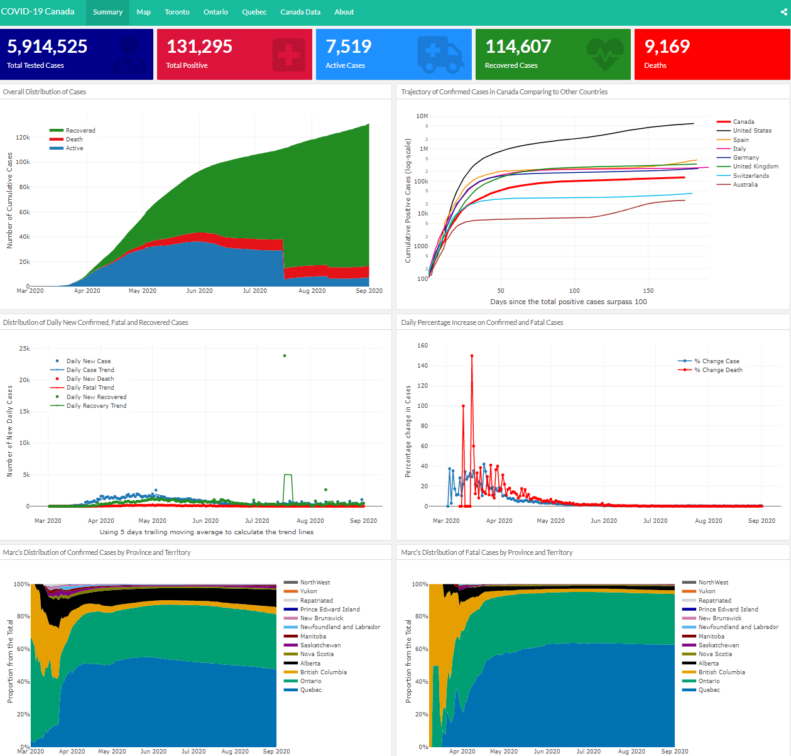
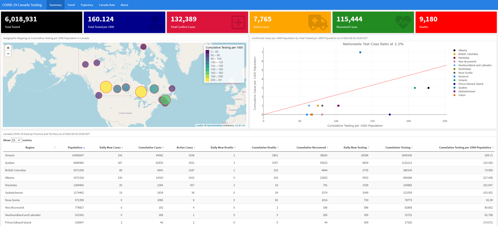

**Date Created:** Jun 01, 2020

**Date Updated:** Sep 04, 2020

 

# From the author

**Thank you for your interest in my COVID-19 data visualization and data analysis work! I created this website to provide a one-stop shop for readers to view all my current and future COVID related projects.**

**I don't intent to style or format this webpage (please excuse the plainness). Feel free to reach me at kuan.liu@mail.utoronto.ca. You can also find me on [Twitter](https://twitter.com/KuanLiu2). For those of you who are interested to learn more about me, I direct you to visit my other website <https://www.kuan-liu.com/>.**

 

# Current Projects

## 1. Estimation of Regional Temporal Reproduction Number R0 of COVID-19

This is work is produced by replicating the subnational analysis provided at <https://epiforecasts.io/covid/> by a team of researchers lead by [Prof. Sebastian Funk](https://www.lshtm.ac.uk/aboutus/people/funk.sebastian) at the Centre for the Mathematical Modelling of Infectious Disases, London School of Hygiene and Tropical Medicine.

Two R packages developed by the same team were used, [the EpiNow R package](https://github.com/epiforecasts/EpiNow) and [the EpiSoon R package](https://github.com/epiforecasts/EpiSoon). In addition, [the forecastHybrid R package](https://github.com/ellisp/forecastHybrid) developed by David Shaub and Peter Ellis is used to produce a 14-day forecast on R0. Canada data is extracted again from the open-access data provided by [the COVID-19 Canada Open Data Working Group](https://github.com/ishaberry/Covid19Canada). 

**Estimation results are shared on this website on subtabs [Provincial level R0](https://kuan-liu.github.io/prov.html) and [City level R0](https://kuan-liu.github.io/city.html). I plan to update estimation results about three times per week.**

 

## 2. COVID-19 Canada Dashboard [(link)](https://kuan-liu.shinyapps.io/canada_dash/)

This is a joint work with [Rose Garrett](https://twitter.com/rose_carrot). Our interactive dashboard is hosted at <https://kuan-liu.shinyapps.io/canada_dash/>. We provide descriptive data visualization on Canada COVID-19 confirmed, active, recovered cases, and deaths data provided by [the COVID-19 Canada Open Data Working Group](https://github.com/ishaberry/Covid19Canada). I coded the original version using Rami Krispin's Covid19 Italy [dashboard](https://github.com/RamiKrispin/italy_dash) as template back in early April.

Highlight of the dashboard content: 

* A summary page on nationwide data
    + Overall distribution of cases, daily new Confirmed, fatal and recovered cases
    + Daily percentage increase on confirmed and fatal cases 
    + Case trajectory with comparison to other countries
    + Confirmed and fatal cases distribution by province and territory 
* A case map page (using Leaflet)
* A summary page for Toronto, Ontario and Quebec
* A page with Canada COVID-19 data table

 

 

## 3. COVID-19 Canada Testing Dashboard [(link)](https://kuan-liu.shinyapps.io/Testing_Dash/)

We provide a comprehensive descriptive data visualization on COVID-19 testing data in Canada. Data used in this dashboard are from [the COVID-19 Canada Open Data Working Group](https://github.com/ishaberry/Covid19Canada) and [Our World In Data]( https://github.com/owid/covid-19-data/tree/master/public/data/).

Project Members

  - Kuan Liu
  - [Thai-Son Tang](https://twitter.com/ThaiSonTang) 
  - [Rose Garrett](https://twitter.com/rose_carrot)
  - [Alexandra Bushby](https://www.linkedin.com/in/alexandra-bushby-571b65168/)
  - [Maxwell Garrett](https://github.com/maxwell-garrett)

 

