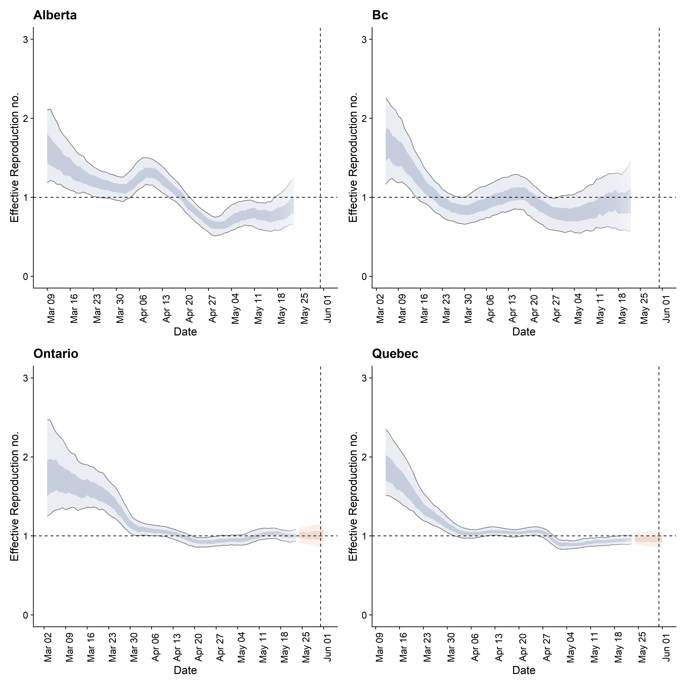
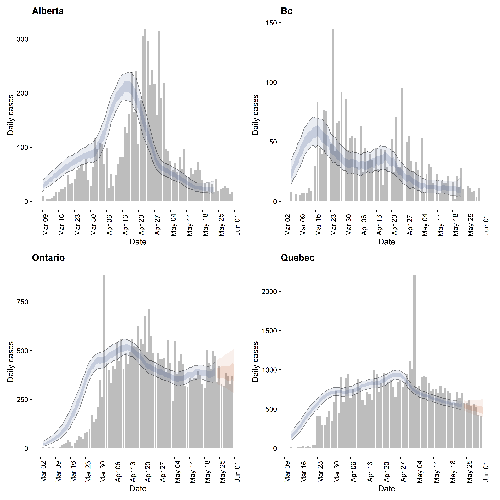
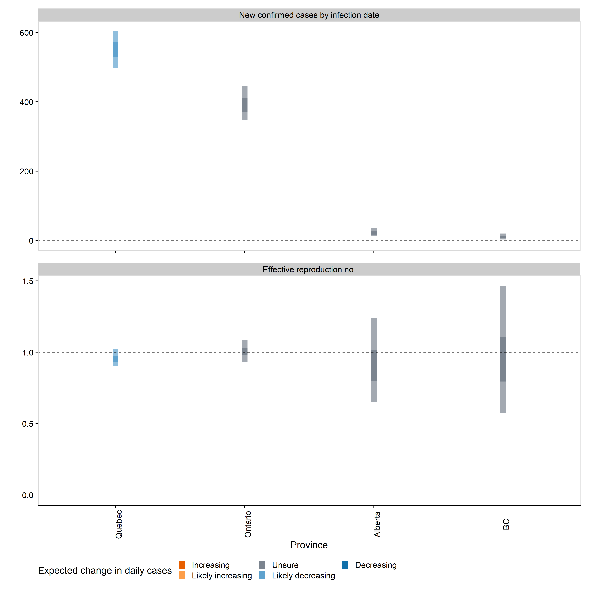

**Date Created:** June 01, 2020

**Date Updated:** Jun 01, 2020

 

# 1. Overview on Estimation Methods

For estimation methods please see <https://epiforecasts.io/covid/methods.html>. 

In a nutshell, the reproduction number is estimated with a stochastic (infection) generation model under a Bayesian framework using MCMC with an informative gamma prior (mean 2.6 and standard deviation 2, based on initial Wuhan R0 estimates).

Estimation of R0 accounts for reporting delay, what is defined as the time between sympton onset and reporting. The delay time distribution is estimated using an international data (avaliable at <https://github.com/epiforecasts/NCoVUtils>) while sympton onset date and reporting date are both recorded. Unfortunately, there is no open-access data on such information in Canada, so there could be potential bias using an estimates of this delay from data of other Countries.

Last but not least, a 14-day forecast of R0 is conducted with the ensumble time series models using [the forecastHybrid R package](https://github.com/ellisp/forecastHybrid) developed by David Shaub and Peter Ellis.

 

# 2. Provintial Level Estimation Results

## (1) Overall summary

* **We observed a highly probable declining of infection in Quebec. Infection spread and rate (decreasing or increasing) in unclear for the other three provinces.**
* **No forecast of R0 for Alberta and BC due to low number of daily new cases. Prediction is not completed if the last daily new case number is under 40.**

 

## (2) Figures and tables

### (i) Estimated temporal R0 and daily new cases for Alberta, BC, Ontario and Quebec

Table: Estimated temporal R0 and daily new cases for Alberta, BC, Ontario and Quebec as of  Jun 01, 2020

 Province    New confirmed cases by infection date    Expected change in daily cases    Effective reproduction no. 
----------  ---------------------------------------  --------------------------------  ----------------------------
 Alberta                 26 (13 -- 37)                            Unsure                     0.9 (0.6 -- 1.2)      
    BC                   13 (3 -- 20)                             Unsure                      1 (0.6 -- 1.5)       
 Ontario               395 (348 -- 446)                           Unsure                      1 (0.9 -- 1.1)       
  Quebec               552 (497 -- 603)                     Likely decreasing                  1 (0.9 -- 1)        

 

### (ii) Estimated temporal R0 for Alberta, BC, Ontario and Quebec

 

### (iii) Estimated temporal trend on daily new cases for Alberta, BC, Ontario and Quebec

 

### (iv) Estimated current/latest number of daily new cases and R0 for Alberta, BC, Ontario and Quebec

